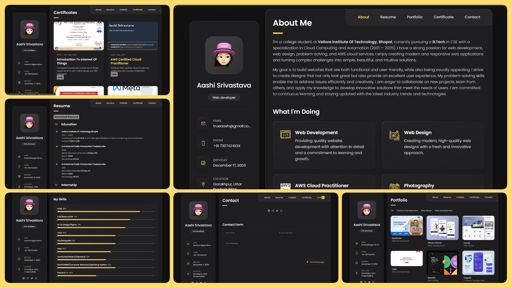
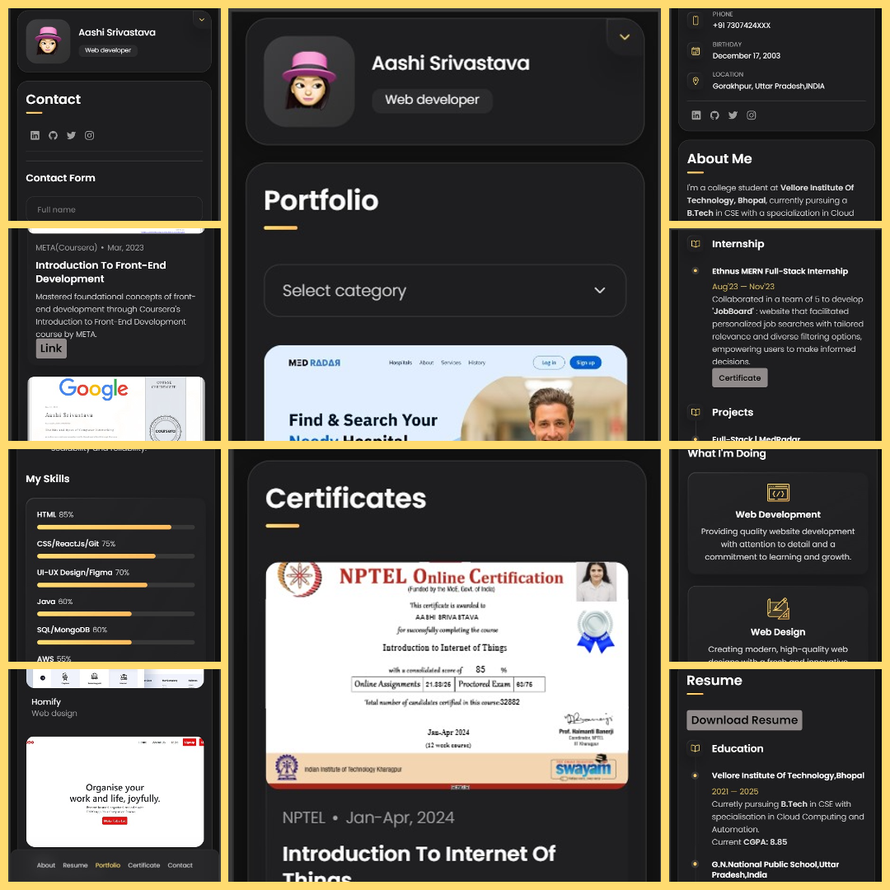

# Portfolio Website

## Overview

Welcome to my portfolio website repository! This project showcases my skills, experiences, and projects as a Front-End Developer. The website is designed to provide a comprehensive overview of my work, allowing visitors to explore my professional journey and get a sense of my capabilities and expertise.

## Live Demo

Check out the live demo [here](https://trueaashi.github.io/Portfolio_Aashi/).

## Features

- **Responsive Design:** The website is fully responsive, ensuring an optimal viewing experience across all devices, including desktops, tablets, and smartphones.
- **Clean and Modern Layout:** The design focuses on simplicity and clarity, with a modern aesthetic that highlights content without overwhelming the user.
- **Project Showcase:** A dedicated section for showcasing my projects, including detailed descriptions, technologies used, and links to live demos or repositories.
- **About Me:** A personal introduction that includes my background, skills, and professional experiences.
- **Contact Form:** A contact form that allows visitors to reach out to me directly from the website.
- **Interactive Elements:** Engaging animations and interactive elements to enhance user experience.

## Technologies Used

- **HTML5 & CSS3:** For structuring and styling the website.
- **JavaScript:** To add interactivity and dynamic content.
- **Framework/Libraries:** [e.g., React, Vue.js, Bootstrap] for building a responsive and scalable website.
- **Version Control:** Managed with Git and hosted on GitHub for collaborative development and version tracking.

## Demo

